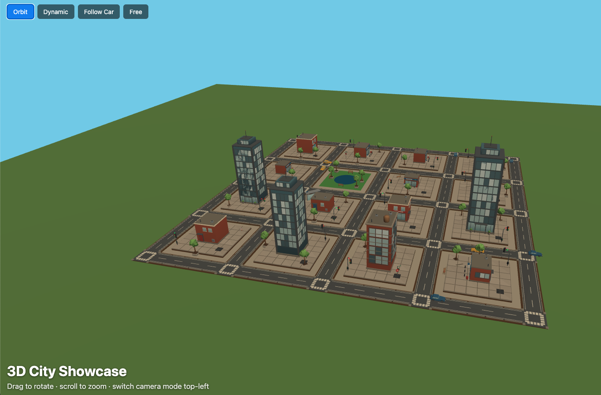

# 3D City Showcase

A procedurally generated 3D city built with Three.js. A grid of intersections, roads, buildings, and street furniture is laid out from a seeded PRNG, populated with driving traffic that follows left-hand lane rules, and viewable through four camera modes.

**Live demo:** https://3d-city-showcase.vercel.app/



## Features

- Procedural grid layout: roads, building plots, and a park block generated from a seeded random number generator, so the same seed always produces the same city
- Overlap-avoiding placement for buildings, street furniture, and greenery
- Driving traffic with left-hand lane rules and same-lane speed sync (so cars never rear-end each other on the closed loop)
- Decorative traffic lights that cycle green/yellow/red
- Four camera modes: Orbit (auto-rotating overview), Dynamic (scripted multi-viewpoint tour), Follow Car (chase camera), Free (fully static)

## Stack

Vite, TypeScript, Three.js (`GLTFLoader` + `DRACOLoader` for Draco-compressed models), `THREE.Timer`, `OrbitControls`.

## Getting started

```bash
npm install
npm run dev
```

The dev server runs at `http://localhost:5173`.

## Building

```bash
npm run build
```

Type-checks with `tsc` then builds with Vite into `dist/`.

## Assets

City-kit models (roads, buildings, cars, street furniture) are from [threejsassets.com](https://threejsassets.com), Draco-compressed GLBs. `scripts/download-assets.sh` re-downloads them given an exported `cookies.txt` from a logged-in session (not committed).

## Project structure

```
src/
  main.ts             entry point, scene/camera/renderer setup, animation loop
  city-layout.ts       procedural city generation (roads, buildings, vehicles, traffic lights)
  camera-director.ts   scripted viewpoint cycling for Dynamic camera mode
  load-models.ts       GLTF/Draco model loading
  models.ts            model slug definitions
public/
  assets/models/       .glb city-kit assets
  draco/               Draco decoder files
```
